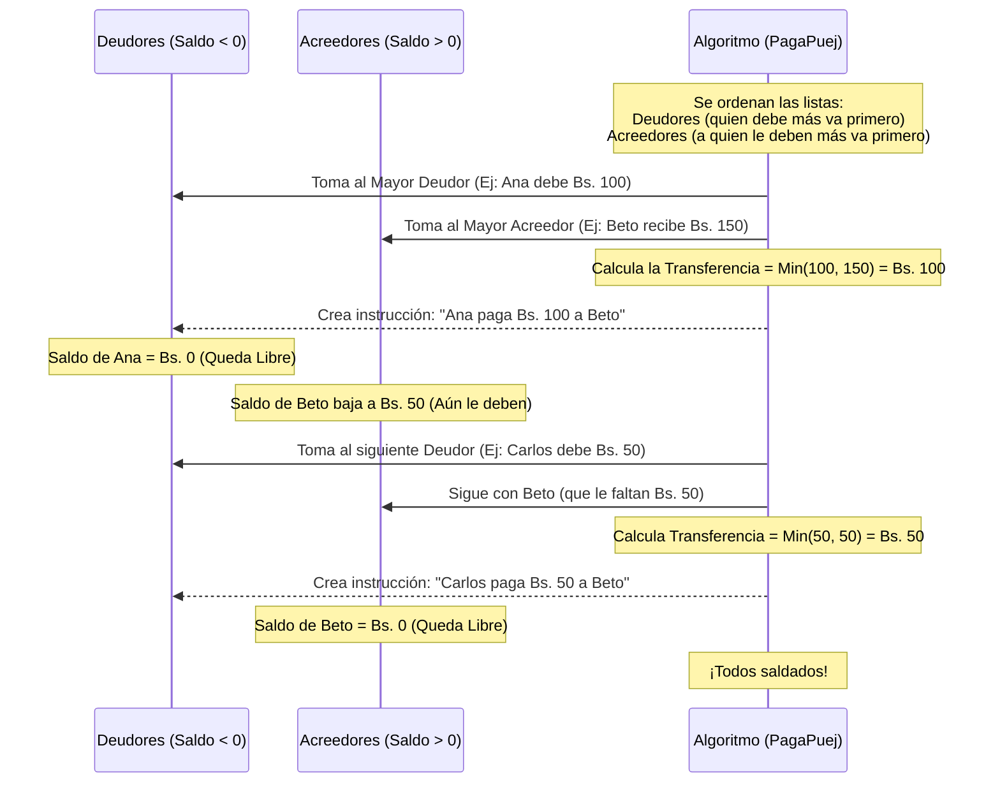

# 🛡️ Guía de Defensa — PagaPuej

Este documento explica de forma didáctica la arquitectura, los flujos y la lógica central de **PagaPuej** ("Cuentas Claras, Amistades Duraderas") para preparar tu defensa del proyecto.

*(Nota: Mencionaste el flujo del "inquilino y propietario", pero asumo que te refieres al de **"Deudor (quien debe dinero)"** y **"Acreedor (a quien le deben)"** en el contexto de nuestra aplicación para dividir gastos).*

---

## 🏗️ 1. Arquitectura del Proyecto (¿Qué contiene cada cosa?)

PagaPuej es una aplicación "Full-Stack" construida bajo un patrón de arquitectura moderna usando **Next.js (App Router)**. Aquí te explico qué contiene cada capa:

- **Frontend (Interfaz de Usuario):**
  - **Tecnologías:** React, Next.js, Tailwind CSS, Framer Motion, shadcn/ui.
  - **Ubicación:** Todo lo que el usuario ve está en la carpeta `src/app/` (páginas) y `src/components/` (botones, tarjetas, modales).
  - **Cómo funciona:** La app mezcla *Server Components* (para cargar datos rapidísimo desde el servidor antes de enviarlos a la pantalla) y *Client Components* (para que haya interactividad como modales y animaciones).

- **Backend & Base de Datos:**
  - **Tecnologías:** Supabase (Base de datos PostgreSQL + Autenticación) y Drizzle ORM (La herramienta que traduce nuestro código TypeScript a consultas SQL).
  - **Ubicación:** 
    - `src/server/db/schema.ts`: Define las tablas y cómo se relacionan.
    - `src/server/actions/`: Donde se guarda y modifica la información de forma segura en el servidor.
    - `src/server/queries/`: Donde solo leemos la información.
  - **Cómo funciona:** El frontend no toca directamente la base de datos. Pide las cosas a través de los *Server Actions*, manteniendo la seguridad.

- **Motor Lógico (El "Cerebro"):**
  - **Ubicación:** `src/lib/calculations.ts`.
  - **Cómo funciona:** ¡Todo el dinero se maneja en "Centavos" matemáticos (números enteros)! Esto evita los horribles bugs del navegador cuando intenta restar decimales (como 0.3 - 0.2). Aquí vive la matemática del proyecto.

---

## 🔄 2. Flujo de Deudores y Acreedores (Diagrama de Liquidación)

Cuando los amigos registran gastos, el sistema calcula un "Balance". Quienes gastaron mucho dinero por los demás terminan con saldo Positivo (Acreedores) y quienes no gastaron terminan con saldo Negativo (Deudores).

El siguiente diagrama explica cómo el algoritmo calcula quién debe pagarle a quién para saldar cuentas con la **menor cantidad de transacciones posibles**.

### 🧠 ¿Dónde está esto en el código y por qué se hace así?
**Ubicación:** Archivo `src/lib/calculations.ts` (Función `calculateSettlement`).

**¿Cómo y por qué?**
A este enfoque en ciencias de la computación se le llama algoritmo "Goloso" (*Greedy* con *Two-Pointers*). 
**Explicación didáctica:** Si 5 personas deben dinero y 5 personas deben recibir dinero, lo peor que podemos hacer es que todos se pasen moneditas entre todos (25 transferencias). En su lugar, el algoritmo agarra al que tiene el agujero más grande en el bolsillo (mayor deudor) y lo empareja con el que tiene la montaña más grande de dinero por recibir (mayor acreedor). Así, se neutralizan mutuamente rápido y logramos "saldar" el viaje en el menor número de pasos.

---

## 💵 3. Flujo de División de Gastos (El "Misterio" de los Decimales)

Otro aspecto brillante del proyecto es cómo el sistema evita perder dinero cuando divide cifras inexactas (Ej. Dividir Bs. 100 entre 3 amigos).

**Ubicación:** Archivo `src/lib/calculations.ts` (Función `calculateBalances`).

**¿Cómo y por qué?**
- **Transformación:** Todo se lee como centavos (Bs. 100 = `10,000` centavos).
- **División Base:** Dividimos 10,000 entre 3, ignorando decimales. La base es `3333` (Bs. 33.33).
- **El Residuo:** Calculamos lo que sobra: `10000 % 3 = 1` centavo suelto.
- **La magia:** El algoritmo reparte ese `1 centavo extra` a las primeras personas de la lista para cuadrar a cero.
  - Amigo 1 se debita: Bs. 33.34
  - Amigo 2 se debita: Bs. 33.33
  - Amigo 3 se debita: Bs. 33.33
- **Didácticamente:** Si usamos una calculadora normal, `100 / 3 = 33.33`. Si multiplicamos eso por 3, da `99.99`. Un sistema real no puede perder ese centavo porque los balances nunca llegarían a 0, haciendo fallar la liquidación. Con nuestra técnica de "reparto de residuos", el dinero nunca desaparece de la nada.

---

## 🛡️ 4. Posibles Preguntas del Jurado y Dónde Encontrar las Respuestas

**Pregunta 1: *"¿Por qué decidieron usar Next.js en lugar de hacer un React puro clásico (Vite o Create React App)?"***
- **Respuesta:** "Usamos Next.js con el App Router porque nos permite correr código directamente en el servidor (*Server Components* y *Server Actions*). Esto es súper seguro porque nunca enviamos las credenciales de la base de datos al navegador del cliente. Además, carga mucho más rápido."
- **En el código:** Muestra cualquier archivo en la carpeta `src/server/actions/`. Las funciones tienen la palabra `"use server"` arriba, lo que le dice al sistema que ese código es exclusivo de backend.

**Pregunta 2: *"¿Qué pasa si al momento de registrar un gasto, la base de datos falla a la mitad y registra el gasto pero no la división?"***
- **Respuesta:** "Protegimos la base de datos usando **Transacciones** atómicas de PostgreSQL. Cuando creamos un gasto y asignamos las porciones, encapsulamos las dos consultas en un `db.transaction()`. Si una de las dos falla, toda la acción se cancela (Rollback), garantizando que nunca quede información corrupta o a medias."
- **En el código:** Archivo `src/server/actions/trips.ts`, dentro de la función `createExpenseAction`.

**Pregunta 3: *"¿Cómo manejan la seguridad? ¿Alguien podría ver los viajes de otro usuario si averigua su ID?"***
- **Respuesta:** "No. Utilizamos la autenticación oficial de Supabase. Cada vez que alguien pide la lista de viajes o los detalles, el sistema verifica primero la cookie criptográfica (sesión JWT) en el servidor. Luego, cruzamos el ID del viaje con la tabla `trip_members` filtrando explícitamente por el ID del usuario autenticado."
- **En el código:** Archivo `src/server/queries/trips.ts`, dentro de las funciones `getUserTrips` y `getTripWithDetails`.

**Pregunta 4: *"¿Cómo conectaron las relaciones en la base de datos?"***
- **Respuesta:** "Implementamos un esquema relacional con Drizzle ORM. Usamos claves foráneas (*Foreign Keys*). Por ejemplo, un Viaje (`trips`) puede tener múltiples Participantes (`participants`). Y cuando se hace un Gasto (`expenses`), ese gasto está enlazado a un Viaje, pero dividido usando una tabla intermedia (`expense_splits`) que conecta con cada Participante."
- **En el código:** Archivo `src/server/db/schema.ts`. Es el corazón estructural, ahí puedes mostrarles visualmente cómo cada tabla hace referencia (`.references()`) a las demás.
